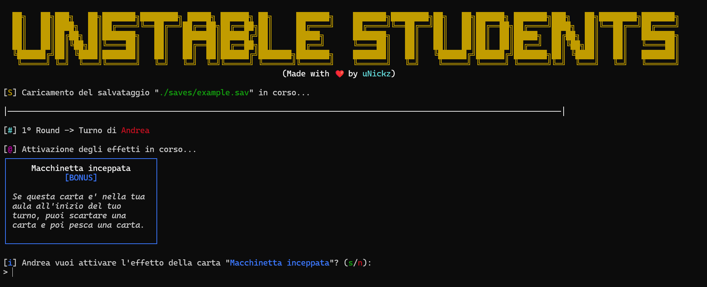

# **UNSTABLE STUDENTS - PR1 2024/25**

>  Questo è un progetto svolto nell'ambito dell'esame di **Programmazione 1 - Modulo II** *(PR1)*, A.A. 2024/25, del **CdL in Informatica** dell'**Università degli Studi di Cagliari**.

---

> ## **Table of Content**
>  0. [Repository Structure](#repository-structure)
>  1. [Spiegazione file sorgente](#spiegazione-file-sorgente)
>     - [Model](#model)
>     - [Main](#main)
>     - [Game](#game)
>     - [Player](#player)
>     - [Card](#card)
>     - [Effect](#effect)
>     - [Logging](#logging)
>     - [Save/Load](#saveload)
>     - [Utils](#utils)
>  2. [Descrizione flusso di gioco](#descrizione-flusso-di-gioco)
>     - [Fase 0: Preparazione](#fase-0-preparazione)
>     - [Fase 1: Inizio partita](#fase-1-inizio-partita)
>     - [Fase 2: Pesca](#fase-2-pesca)
>     - [Fase 3: Azione](#fase-3-azione)
>     - [Fase 3: Azione (Difendersi)](#fase-3-azione-difendersi)
>     - [Fase 4: Fine del turno](#fase-4-fine-del-turno)
>     - [Fase 5: Fine del gioco](#fase-5-fine-del-gioco)
>  3. [Compilazione e Esecuzione](#compilazione-e-esecuzione)
>     - [Windows (MinGW)](#windows-mingw)
>     - [Linux (gcc)](#linux-gcc)

---

## **Repository Structure**

```
REPOSITORY STRUCTURE
.
|
│ OTHER STUFF
├── other                       // Cartella contenente i file aggiuntivi (non necessari per la compilazione)
│   ├── media                   // Cartella contenente i file multimediali
│   │   └── ...
│   ├── line_counter.py         // Script Python per il conteggio delle righe di codice del progetto
│   ├── mazzo.json              // File in formato JSON contenente le carte del mazzo
│   └── parser.py               // Script Python per il parsing del file mazzo.txt in formato JSON
|
│ GAME SAVES
├── saves                       // Cartella contenente i salvataggi
│   ├── example.sav             // Esempio di file di salvataggio
│   ├── riepilogo_savegame.pdf  // Riepilogo in formato PDF del salvataggio "example.sav"
│   └── saves_list.txt          // File contenente la lista dei salvataggi registrati
|
│ SOURCE FILES
├── src                         // Cartella contenente i file sorgenti
│   ├── card                    // Cartella contenente i file sorgenti delle carte
│   │   ├── card.c
│   │   └── card.h
│   ├── core                    // Cartella contenente i file sorgenti del cuore del gioco
│   │   ├── game.c
│   │   ├── game.h
│   │   └── main.c
│   ├── effect                  // Cartella contenente i file sorgenti degli effetti
│   │   ├── effect.c
│   │   └── effect.h
│   ├── logging                 // Cartella contenente i file sorgenti del logging
│   │   ├── logging.c
│   │   └── logging.h
│   ├── model                   // Cartella contenente i file sorgenti dei modelli
│   │   ├── colors.h
│   │   ├── constants.h
│   │   ├── enums.h
│   │   └── structs.h
│   ├── player                  // Cartella contenente i file sorgenti dei giocatori
│   │   ├── player.c
│   │   └── player.h
│   ├── save_load               // Cartella contenente i file sorgenti del salvataggio/caricamento
│   │   ├── save_load.c
│   │   └── save_load.h
│   └── utils                   // Cartella contenente i file sorgenti delle utility
│       ├── utils.c
│       └── utils.h
│
│ OTHER FILES
├── Makefile                    // Makefile per la compilazione del progetto
├── README.md                   // File README (contentenete la relazione e la documentazione) del progetto
├── Specifiche_v2.0.pdf         // Specifiche del progetto
├── mazzo.txt                   // File contenente le carte del mazzo
└── .gitignore                  // File .gitignore per ignorare i file non necessari
```

---

## **Spiegazione file sorgente**
> [!TIP]
> Per ogni file sorgente (.c/.h) presente nel progetto, spiegare brevemente il contenuto e lo scopo del file.

### Model
I file `colors.h`, `constants.h`, `enums.h` e `structs.h` contengono le definizioni di costanti, enumerazioni e strutture dati utilizzate in tutto il progetto. In particolare, vengono definite le costanti per i colori, i tipi di carte, gli effetti delle carte e le strutture dati per i giocatori e le carte.

### Main
Il file `main.c` contiene la funzione `main` del programma. In questa funzione vengono inizializzate le variabili necessarie per l'avvio di una partita e viene gestito il loop iniziale del programma, che permette di scegliere di:
- Iniziare una nuova partita.
- Caricare una partita salvata.
- Uscire dal gioco.

### Game
I file `game.h` e `game.c` contegono le funzioni per la gestione del gioco vero e proprio. In particolare, vengono gestite le fasi di gioco, come:
- Inizializzazione di una nuova partita.
- Svolgimento di una partita.
    + Contenente il loop principale del gioco.
- Controllo della vittoria.

### Player
I file `player.h` e `player.c` contengono le funzioni per la gestione dei giocatori. In particolare, vengono gestite le azioni dei giocatori, come:
- Aggiunta di un giocatore alla partita.
- Inizializzazione di un giocatore.
- Controlli sulle carte in mano di un giocatore.
- Scelta di un giocatore da parte di altro giocatore (es. per l'effetto di una carta).
- Formatazione e stampa delle informazioni di un giocatore.
- Liberazione della memoria allocata per un giocatore.

### Card
I file `card.h` e `card.c` contengono le funzioni per la gestione delle carte. In particolare, vengono gestite le azioni delle carte, come:
- Caricamento di un mazzo di carte da file.
- Gestione delle carte in generale (es. selezione di una carta, scartare una carte, aggiunta di una carta in un mazzo, ecc.).
- Controlli sui mazzi di carte (es. controllo se in un mazzo è presenta una carta, un effetto o un tipo di carta specifico).
- Formatazione e stampa delle informazioni di una carta.
- Formatazione e stampa delle informazioni di un mazzo di carte.
- Liberazione della memoria allocata per una carta.

### Effect
I file `effect.h` e `effect.c` contengono le funzioni per la gestione degli effetti delle carte. In particolare, vengono gestite le azioni degli effetti, come:
- Controllo se un effetto è presente in una carta.
- Controllo se un effetto è da attivare in un determinato momento.
- Gestione della difesa di un giocatore da un effetto.
- Applicazione di un effetto (es. gioca una carta, scarta una carta, elimina una carta, ecc.).

### Logging
I file `logging.h` e `logging.c` contengono le funzioni per la gestione del logging. In particolare, vengono gestite le azioni di logging, come:
- Inizializzazione del file di log.
- Registrazione di un evento nel file di log.

### Save/Load
I file `save_load.h` e `save_load.c` contengono le funzioni per la gestione del salvataggio e del caricamento di una partita salvata. In particolare, vengono gestite le azioni di salvataggio e caricamento, come:
- Salvataggio di una partita in corso.
- Caricamento di una partita salvata.
- Registrazione delle partite salvate in un file di testo (usato come cronologia dei salvataggi).

### Utils
I file `utils.h` e `utils.c` contengono le funzioni di utilità che vengono utilizzate continuamente in tutti i file del progetto. In particolare, vengono gestite le azioni di utilità, come:
- Funzioni di lettura di input da parte dell'utente (es. un intero, un carattere, ecc.).
- Funzioni su stringhe (es. confronto tra stringhe, ricerca di una sottostringa, conteggio delle occorrenze di un carattere, ecc.).
- Funzioni per la gestione della memoria (es. allocazione e deallocazione di memoria, copia di stringhe, ecc.).
- Funzioni per la gestione dei file (es. apertura di un file, lettura e scrittura di un file, ecc.).

---

## **Descrizione flusso di gioco**
> [!TIP]
> Descrivere ad alto livello come vengono gestite le varie fasi di gioco (es. il loop principale, la gestione degli eventi, ecc.)

### Fase 0: Preparazione
In questa fase, una partita può essere inizializzata in due modi:
- Iniziando una nuova partita.
- Caricando una partita da un file di salvataggio.


Viene chiesto all'utente di scegliere tra queste due opzioni. Se l'utente sceglie di iniziare una nuova partita, vengono inizializzate tutte le informazioni necessarie per l'avvio di una partita. Se l'utente sceglie di caricare una partita, viene chiesto all'utente di inserire il nome del file di salvataggio da caricare e successivamente vengono caricate tutte le informazioni necessarie per continuare la partita da dove era stata interrotta.
<br>

**N.B.:** Se il file di salvataggio viene passato come argomento da riga di comando, la partita viene caricata automaticamente.
<br>

Se l'utente vuole caricare una partita da un file di salvataggio, gli viene prima chiesto se vuole caricare una partita dalla cronologia dei salvataggi. Se l'utente risponde di sì, viene visualizzata la lista dei salvataggi registrati e l'utente può scegliere il salvataggio da caricare. Se l'utente risponde di no, viene chiesto di inserire il nome del file di salvataggio da caricare.


**N.B.:** Se il file di salvataggio non esiste, viene visualizzato un messaggio di errore e l'utente viene riportato al menu iniziale.


Se l'utente vuole iniziare una nuova partita, gli viene chiesto di inserire il nome da assegnare alla partita. Successivamente, viene chiesto all'utente di inserire il numero e il nome dei giocatori che parteciperanno alla partita. 
<br>

### Fase 1: Inizio partita
In questa fase viene iniziata la partita vera e propria. Il gioco si svolge in un loop principale, che termina quando uno dei giocatori raggiunge un numero di studenti nella propria università maggiore o uguale a `6`, o quando un giocatore decide di uscire dal gioco.



In questa fase vengono eseguite le seguenti azioni:
1. Salvataggio della partita nell'apposito file binario di salvataggio.
2. Stampa del numero del turno e il nome del giocatore di quel turno.
3. Controllo degli effetti con attivazione `INIZIO` (effetti che si attivano all'inizio del turno) e applicazione degli effetti delle carte bonus/malus.
4. Controllo degli effetti con attivazione `INIZIO` (effetti che si attivano all'inizio del turno) e applicazione degli effetti dell'aula studio.

### Fase 2: Pesca
In questa fase, il giocatore di turno pesca una carta dal mazzo e la aggiunge alla propria mano.


Nel caso il mazzo di pesca non abbia più carte:
- Le carte del mazzo di scarto vengono mescolate.
- Il mazzo di pesca viene scambiato con il mazzo di scarto.
<br>

**N.B.:** Questa operazione di scambio dei mazzi va fatta in tutti i casi in cui sia richiesto di pescare una carta dal mazzo di pesca e questo è vuoto.

### Fase 3: Azione
In questa fase, il giocatore di turno può compiere una delle seguenti azioni:
1. Giocare una carta dalla propria mano.
2. Pescare un'ulteriore carta dal mazzo e aggiungerla alla propria mano.
3. Mostrare la propria mano, l'aula studio e le carte bonus/malus.
4. Visualizzare lo stato degli altri giocatori (numero carte in mano, l'aula studio e le carte bonus/malus).
5. Uscire dalla partita.


Le azioni "giocare una carta" e "pescare un'ulteriore carta" fanno finire la fase di azione.


**N.B.:** Stampare le carte in mano quando si deve giocare una carta.


**N.B.:** Con `[TASTO 3]` vengono stampate tutte le informazioni del giocatore di turno.


**N.B.:** Per il `[TASTO 4]` tenere a mente l'effetto `MOSTRA`.


**N.B.:** Nel caso un giocatore giocasse una carta ISTANTANEA durante il suo turno questa viene automaticamente scartata e non viene applicato alcun effetto.

### Fase 3: Azione (Difendersi)
Quando si applica un effetto ad un altro giocatore, questo può (se ne è in possesso) utilizzare una carta `MAI` che finirà negli scarti e che gli permetterà di interrompere l’esecuzione degli effetti della carta giocata dall'avversario.


Un giocatore può utilizzare il `MAI` anche per impedire che gli venga attribuito un bonus o malus da un altro giocatore.

Quando si utilizza un MAI per difendersi da:
- Un `laureando` &rarr; si interrompono gli effetti ma il laureando rimane nell'aula del giocatore.
- Una `magia` &rarr; si interrompono gli effetti e la carta finisce (come normale) negli scarti.
- Un `bonus/malus` &rarr; la carta finisce negli scarti.

### Fase 4: Fine del turno
Ogni giocatore alla fine del proprio turno può avere un massimo di `5` carte. Dovrà scartare il quantitativo di carte necessario affinché il numero di carte in mano sia minore o uguale a `5`. Il giocatore sceglie che carte scartare nel mazzo degli scarti.


### Fase 5: Fine del gioco
Alla fine di ogni turno si controlla la condizione di vittoria del giocatore corrente. Se la condizione è soddisfatta il gioco finisce e si da un messaggio di congratulazioni al giocatore, altrimenti si passa il turno al giocatore successivo.

**N.B.:** La condizione di vittoria può essere influenzata da dei malus (es. `INGEGNERIZZAZIONE`)

---

## **Compilazione e Esecuzione**

### Windows (MinGW)
Per compilare il progetto su Windows, è necessario avere installato il compilatore `MinGW`. Per compilare il progetto, basta eseguire il comando `mingw32-make` da terminale. Questo comando compila tutti i file sorgenti del progetto e genera l'eseguibile `unstable_students.exe`.

Per eseguire il programma, basta eseguire il comando `unstable_students.exe` da terminale.

**N.B.:** Per una corretta visualizzazione del gioco nel terminale, è consigliato utilizzare un terminale che supporti i [colori ANSI](https://talyian.github.io/ansicolors/) e la visualizzazione dei caratteri unicode (es. `Windows Terminal`).

Per la visualizzazione dei caratteri unicode nel terminale di Windows, è possibile utilizzare il comando `chcp 65001`.

### Linux (gcc)
Per compilare il progetto su Linux, è necessario avere installato il compilatore `gcc`. Per compilare il progetto, basta eseguire il comando `make` da terminale. Questo comando compila tutti i file sorgenti del progetto e genera l'eseguibile `unstable_students`.

Per eseguire il programma, basta eseguire il comando `./unstable_students` da terminale.

**N.B.:** Per una corretta visualizzazione del gioco nel terminale, è consigliato utilizzare un terminale che supporti i [colori ANSI](https://talyian.github.io/ansicolors/) e la visualizzazione dei caratteri unicode.
